# DirectX11_Renderer
# 개요
본 프로젝트는 2022년 1학기 경희대학교 소프트웨어 융합학과 수업인 '게임 그래픽 프로그래밍'에서  
실습한 결과물이다. 실습은 10번의 lab과 3번의 assignment로 진행되었다.  
각각의 lab과 assignment는 수업 조교님들이 작성해준 코드 base + 이전 lab코드를 기반으로   
수업시간에 배운 그래픽스에 관한 핵심내용을 학생들이 적용하는 방식으로 진행되었다. 

# 개발도구
DirectX 11, C++20, hlsl, Visual Studio 2019,

# 내용 소개
lab00 ~ lab10, ass01~ass03는 [LAB0X], [ASS0X] 로 시작하는 commit에  
checkout후 'Game'프로젝트를 시작프로젝트로 설정 하면 바로 실행 시킬 수 있다.(윈도우 운영체제 한정)
## lab01
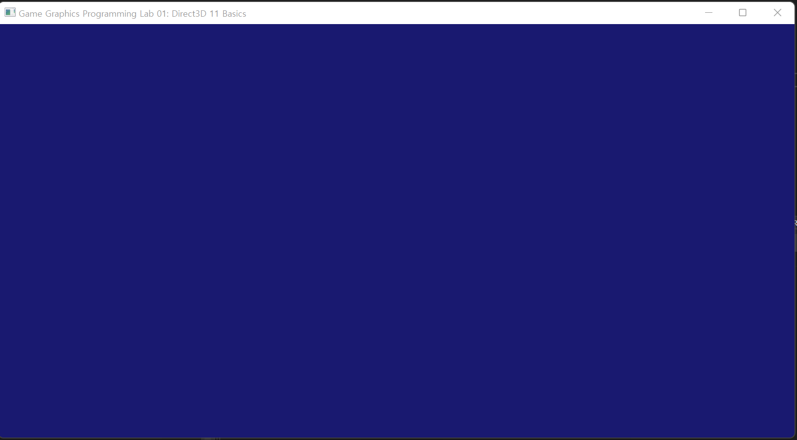
windows api를 이용해 윈도우 출력하기  

## lab02
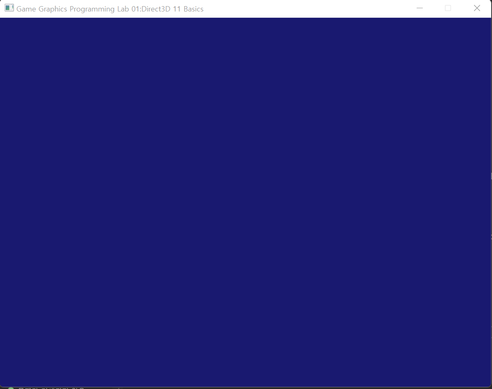
lab01을 object-oriented 로 재설계하기

## lab03
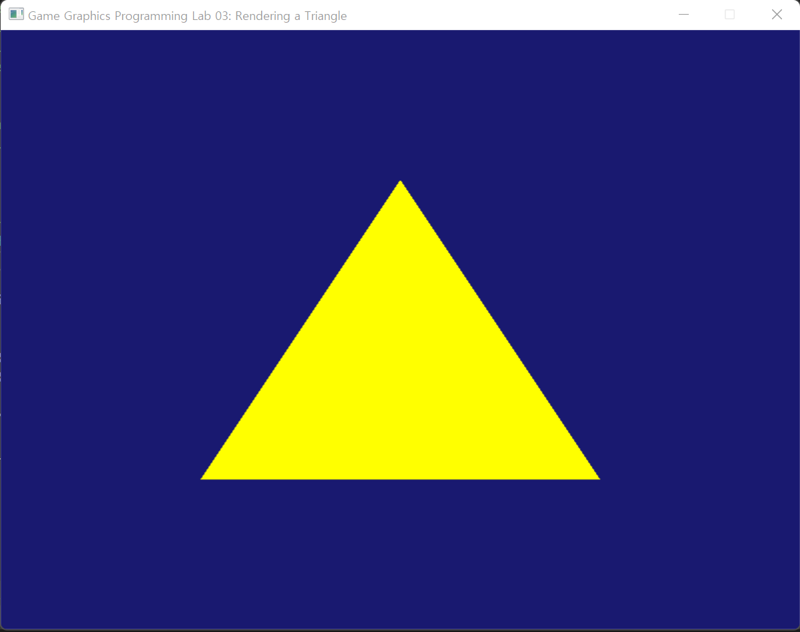
윈도우에 삼각형 출력하기

## lab04
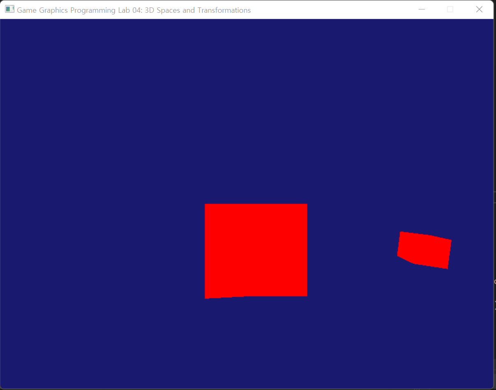
World,View,Projection Matrix를 적용시켜서 3D오브젝트를 윈도우에 출력하기

## lab05
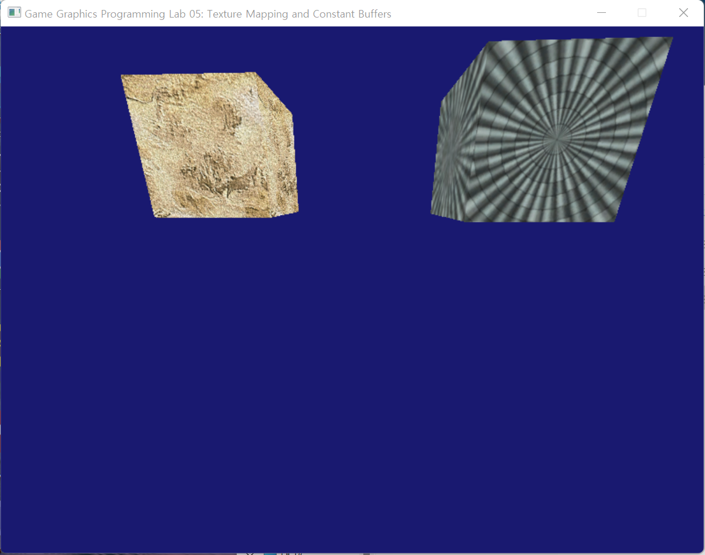
3d 오브젝트에 텍스쳐 입히기

## lab06
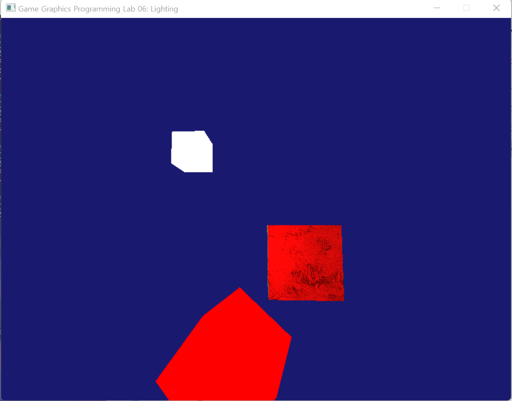
3d 오브젝트에 Phong-Shading 모델 적용하기

## lab07
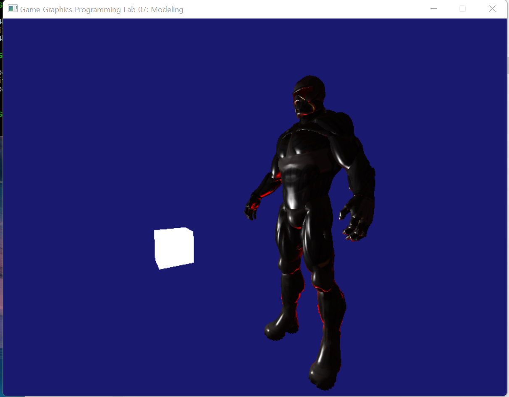
Assimp(open asset import library)를 이용해서 3d 모델 Import후 출력하기

## lab08
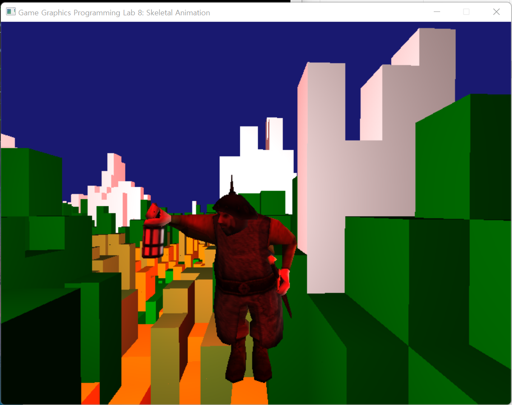
Skeletal 구조로 된 캐릭터 Mesh, animation파일에 작성된 skinning정보를 이용해서
캐릭터 애니메이션 구현하기

## lab09
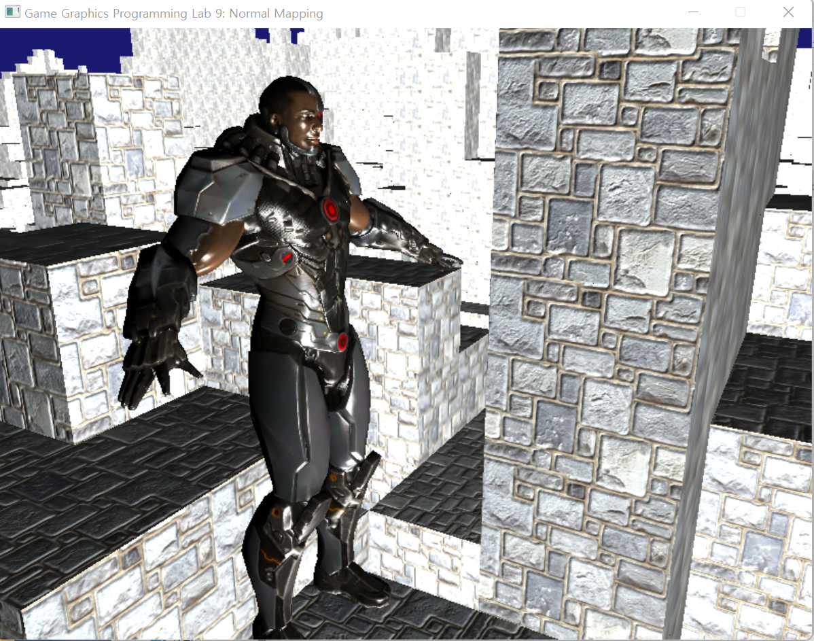
normal map 적용하기

## lab10
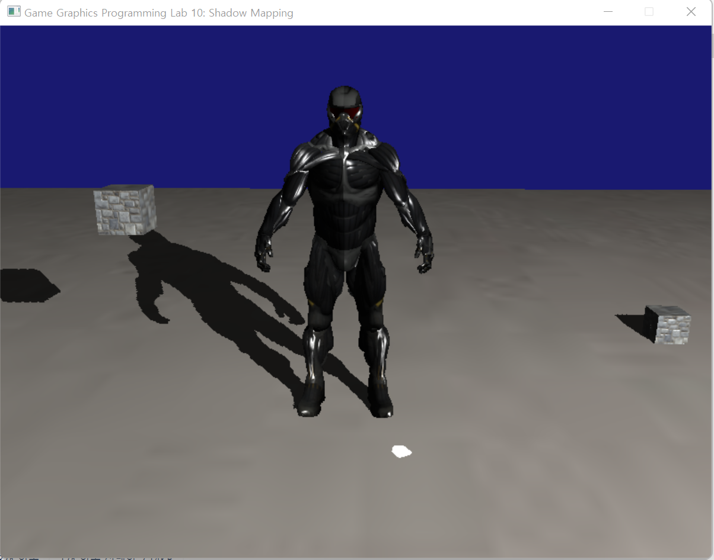
그림자 구현하기

## ass01
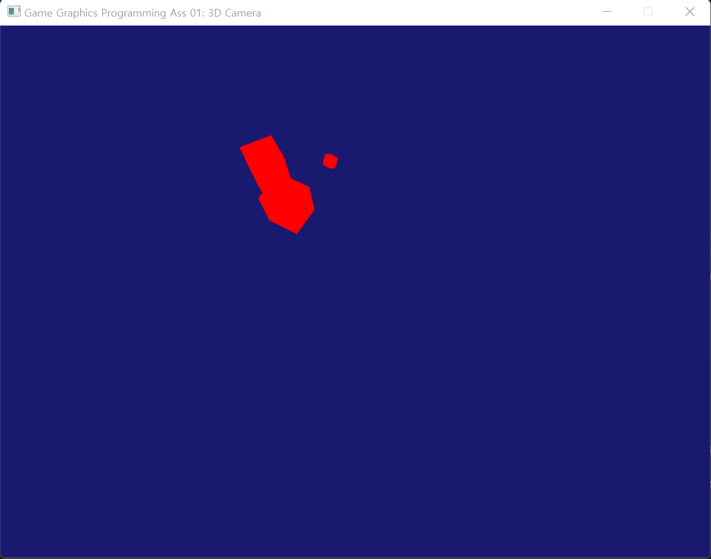
매 프레임 플레이어 입력을 받아서 카메라를 업데이트하는 기능 구현하기

## ass02
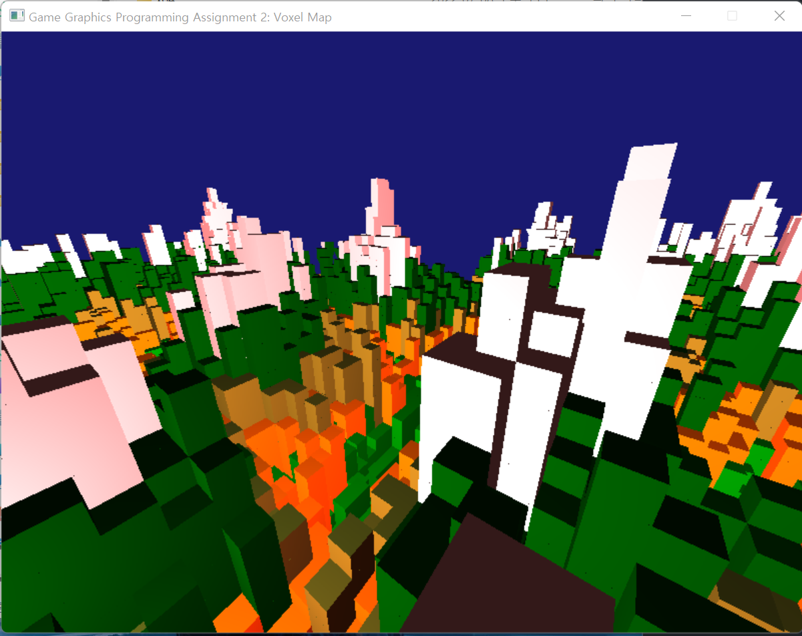
Instance Buffer를 이용해서 Voxel Map 생성하기(Draw Call최소화)

## ass03
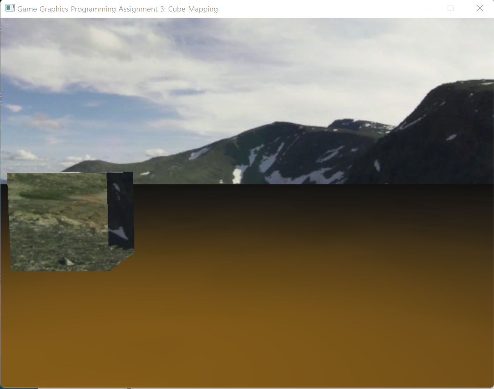
  - Light Attenuation-빛과의 거리에 따라 적용되는 밝기가 달라지는 기능 구현하기     
  - Sky Box- cube map의 일종인 skybox구현하기  
  - reflection Mapping-거울 효과를 주는 정육면체 구현하기(cube map이용)   
